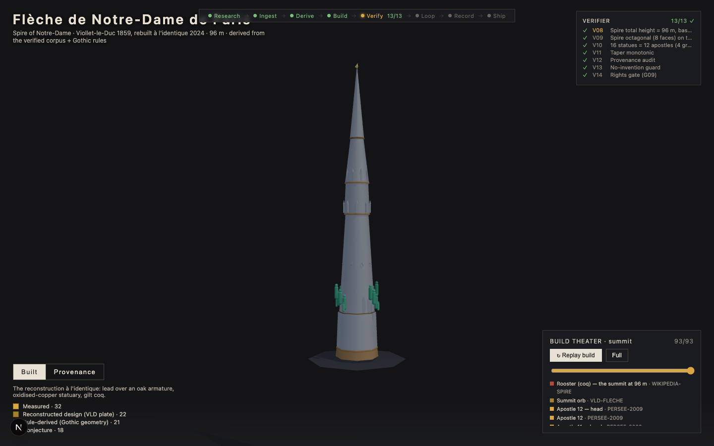
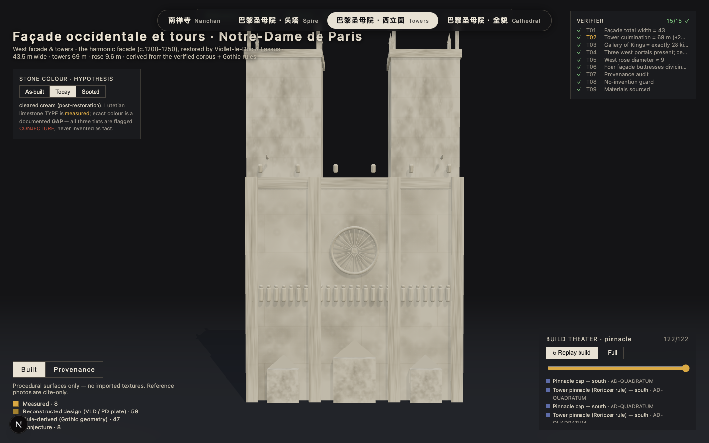
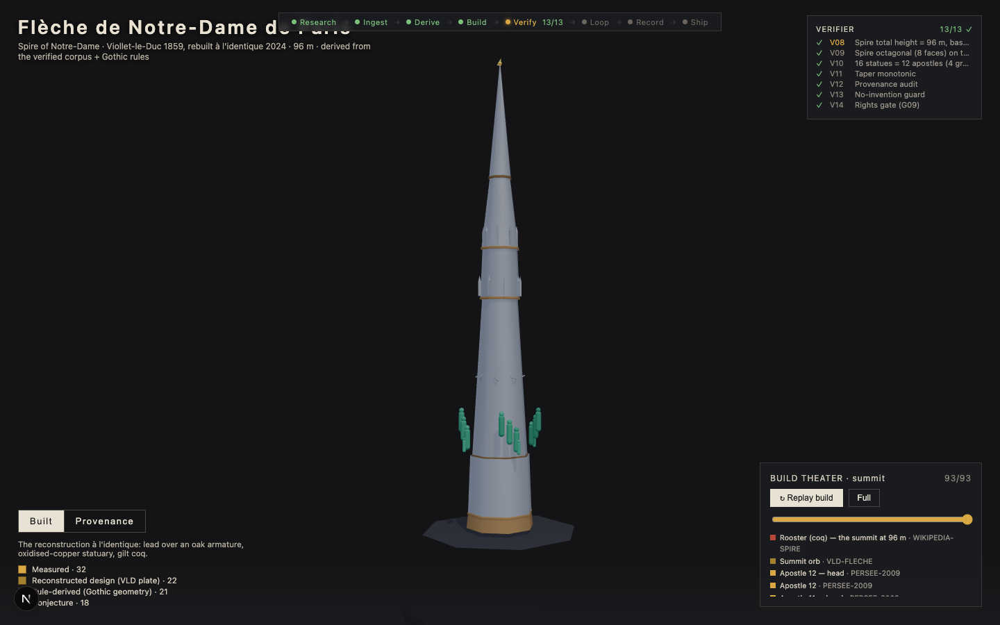
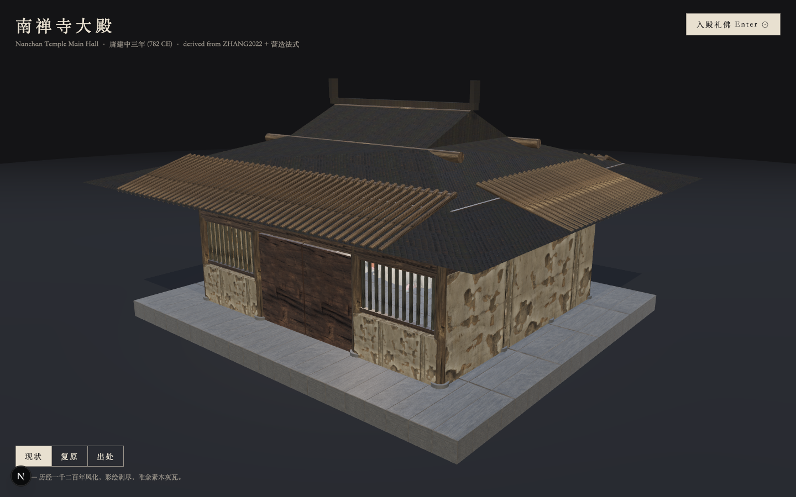
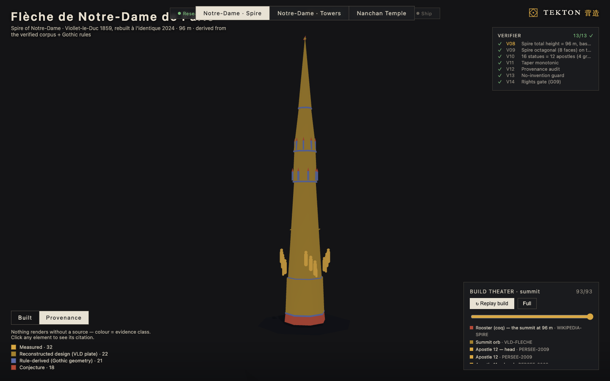
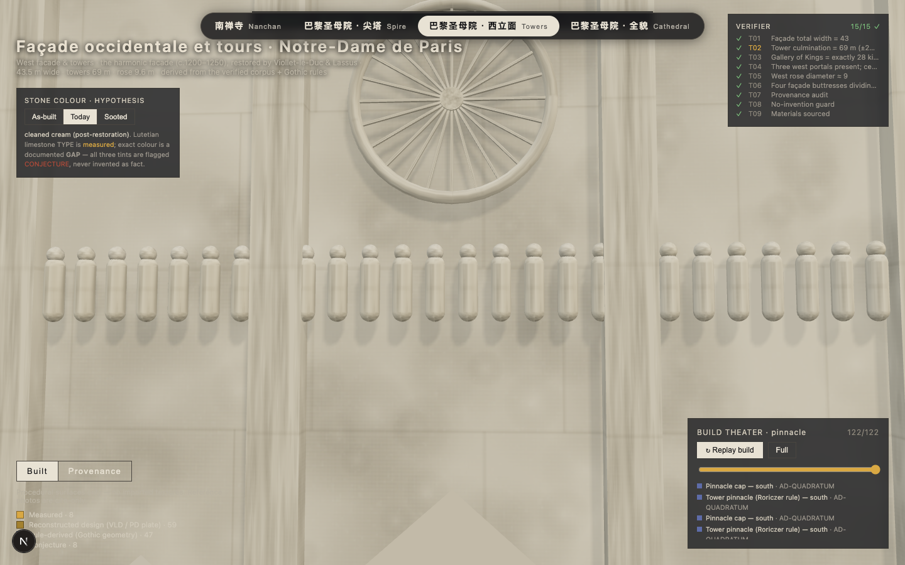
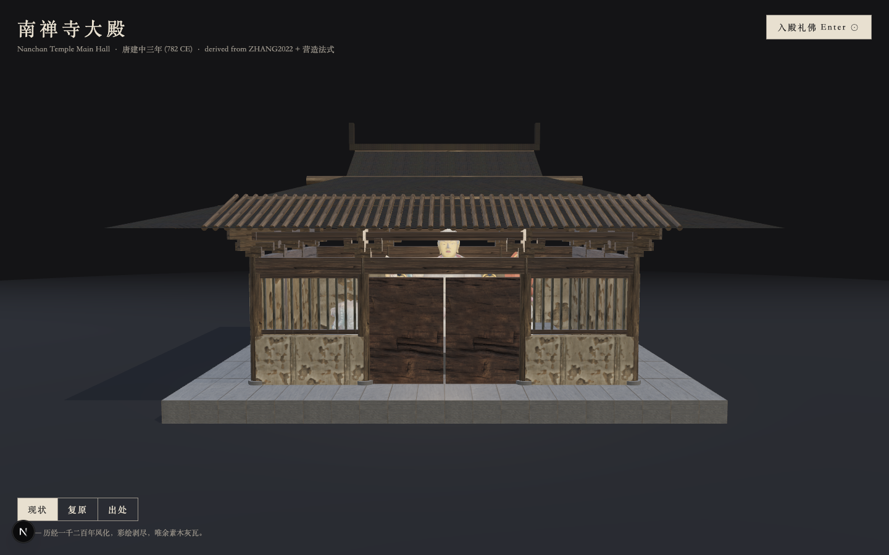
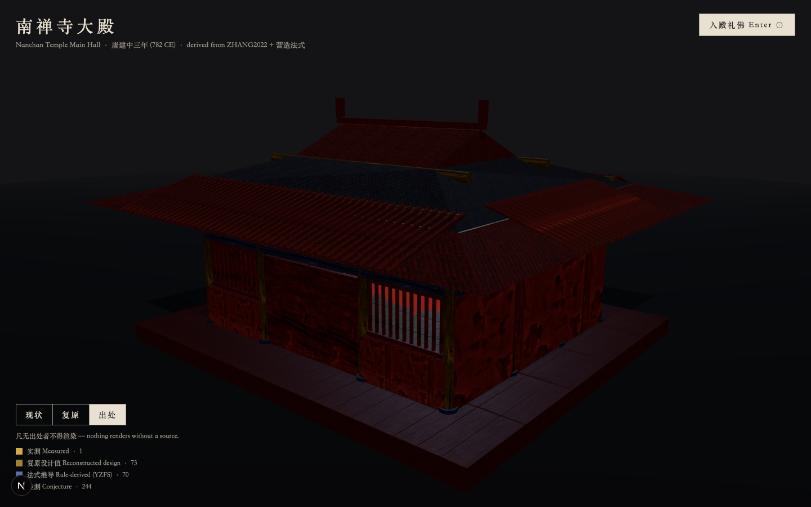

# Tekton 营造

### Evidence-based 3D reconstruction of historic architecture — *nothing renders without a cited source.*

> # 🏆 First Place — Claude Build Day Hackathon 🎉
> **Tekton won 1st place** at the Claude Build Day hackathon (Cerebral Valley), winning **$100K in Claude credits**.
> *— per the official Cerebral Valley winners announcement.*

**▶ Live demo: https://tekton-build.vercel.app**

Built for **Claude Build Day** — an autonomous build pipeline that takes a historic building from *cited research → parametric geometry → live, navigable 3D*, with every element labelled by how strongly it's known (measured / rule-derived / reconstructed / conjecture) and a verifier that refuses anything unsourced.

| Notre-Dame · Spire | Notre-Dame · Towers | Whole Cathedral | Nanchan Temple |
|:--:|:--:|:--:|:--:|
|  |  |  |  |

Four recreations behind one selector: **Notre-Dame de Paris** (the Viollet-le-Duc flèche · west towers & façade · whole-cathedral massing) and **南禅寺大殿 Nanchan Temple Main Hall** (782 CE, the oldest surviving wooden building in China).

#### How the 3D is generated — *not "AI makes an old-looking building"*
A parametric **rule engine** reads a cited data corpus and computes geometry from real architectural rules (e.g. the 1486 Roriczer pinnacle rule, *ad-quadratum* octagon geometry, the Tang *cai-fen* module), emitting a structural spec where **every component carries its provenance + source**. A procedural renderer (React Three Fiber) turns that spec into live Three.js geometry — no imported meshes for Notre-Dame. An independent **verifier recomputes the dimensions from the component coordinates** (never trusting the engine's own claims) and checks them against measured anchors, so the build can't drift toward an idealized rulebook.

| Provenance toggle (colour = evidence class) | Detail fidelity |
|:--:|:--:|
|  |  |

---

## About Tekton

Tekton is a browser-based reconstruction engine for historic architecture. The original build reconstructs the Main Hall of Nanchan Temple, 南禅寺大殿, a 782 CE Tang timber building in Shanxi and the oldest surviving wooden building in China. The project turns survey data, modular construction rules, and provenance constraints into a navigable 3D scene: not "AI makes an old-looking building," but "a model is allowed to render only what it can cite."


## What It Does

Tekton rebuilds Nanchan Temple as an interactive 3D spatial narrative:

- Walk or orbit around a procedurally generated Tang timber hall.
- Scrub a construction sequence from platform to columns, bracket sets, frame, roof, enclosure, and statues.
- Toggle between present-day appearance, reconstructed color hypothesis, and evidence provenance.
- Click annotated bracket components to inspect names, descriptions, and reference imagery.
- Audit every rendered part by evidence class: measured, reconstructed design, rule-derived, or conjecture.
- Run a deterministic verifier that re-measures the generated geometry from component coordinates.





## Why This Matters

China has only a handful of surviving Tang wooden buildings. They are remote, fragile, and often hard for the public to understand even when physically accessible, because the structural story is hidden in the roof frame and bracket sets.

At the same time, historical reconstruction often collapses into scenography: buildings that look generically old while mixing periods, materials, proportions, and undocumented guesses. Tekton takes the opposite position:

> Fidelity should be cheaper than vibes, and every guess should wear a label.

The project validates the method on a building that still exists, where published measurements and historical analysis can check the result. The same pipeline can then be pointed at buildings that are damaged, inaccessible, or gone, with uncertainty kept visible instead of smoothed over.

## The Current Subject

Main Hall of Nanchan Temple, 南禅寺大殿:

- Built in 782 CE, Tang Jianzhong 3.
- Three bays by three bays, single-eave hip-gable roof.
- Perimeter columns only, open interior, no inner columns.
- Column grid: 200:300:200 fen across the facade and 200 fen per depth bay.
- Modular system: 1 fen = 16.5 mm, derived from the published cai-fen analysis.
- Bracket system: column-top 5-puzuo double-jump stolen-heart construction, with no intercolumnar bracket sets.

The reconstruction preserves documented deviations instead of "correcting" them toward later rulebooks. For example, the roof rise is kept at roughly 130 fen, a gentler 1:2.67 ratio, even though a later Yingzao Fashi ideal would push it toward 1:3. The verifier treats that correction as a critical failure.

## How We Used Agents

I treated Claude as an autonomous build engine governed by a written brief and a machine-gradable rubric, then scaled the work the way you would scale any risky build:

1. Scope a small system.
2. Build one verifiable piece.
3. Add texture and historical fidelity.
4. Scale only after deterministic checks say the previous stage is real.

The practical arc:

1. Scope first, in Notion and repo docs. The project started as a hub, PRD, event rules, and goal documents before any serious building. Planning was an artifact, not a vibe.
2. Smallest verifiable piece. Nanchan stayed green as the regression anchor while the agentic pattern was tested on one component or structure tier before expanding.
3. Texture and historical accuracy. A second brief pushed sourced materials, bracket detail, roof behavior, statues, and visual references, with a hard rule that every dimension must cite the corpus or remain a visible `conjecture`.
4. Scale. The same orchestrator and rubric pattern can be parameterized for larger buildings: towers, a full cathedral, or another Chinese timber structure. The gate does not change just because the building gets more complicated.

Mechanisms used to direct Claude:

- Written brief plus gate. The brief is the contract. The build pipeline turns that brief into artifacts: canonical data, derived geometry, verifier report, screenshots, and a static site.
- Deterministic verifier agents. `scripts/verify.mjs` recomputes checks from the component coordinates themselves, not from the spec's claimed dimensions. This is the counterintuitive core: the builder is not allowed to grade itself by reading its own answer key.
- Measured-reality guard. When a historical rule conflicts with measured data, measured data wins. Deviations are recorded as evidence, not treated as errors to be normalized away.
- Fail/revise/pass artifacts. Failed verifier reports are preserved in `artifacts/verifier-report.*.failed.json`. A visible failure loop is evidence of the system catching itself.
- Multi-agent workflow pattern. For unbounded work, I used parallel read-only diagnosers, sequential implementers so edits did not collide, and an adversarial verifier. That pattern was used for data ingest, documentation cleanup, integration work, and live visual fixes.

The thesis is that the product and the build process should share the same discipline: if the user-facing model says "nothing renders without a source," the agentic build process should also refuse to ship without a source.

## Data And Citations

The canonical data lives in [`data/nanchan-canonical.json`](data/nanchan-canonical.json). It is the single source of truth for the derived structure. Each dimensional node carries provenance and source metadata.

Primary source:

- `ZHANG2022`: 张荣, 王一臻, 王麒, 李玉敏. 南禅寺大殿重建背景、材分营造制度分析及建筑像设空间布局研究. 建筑史学刊, 2022, 3(2): 5-23.

Secondary sources:

- `QI1980`: 祁英涛, 柴泽俊. 南禅寺大殿修复 / 修缮工程竣工技术报告.
- `YZFS`: 李诫《营造法式》(1103), public domain.

Provenance classes:

- `measured`: directly measured survey or published factual dimensions.
- `reconstructed_design`: original design values reconstructed by the survey team from measured data.
- `rule_derived`: values derived by this pipeline from cited construction rules.
- `conjecture`: uncertain or restoration-affected values that may render, but must be visibly labeled.

Important rights note: the project uses factual dimensions and locally committed reference assets. It does not use scanned figures from the 2022 paper as render assets. Poly Haven texture sets are used as static PBR materials under their permissive asset terms.

## Build Pipeline

```text
data/nanchan-canonical.json
        |
        v
scripts/derive.mjs
        |
        +--> artifacts/structural-spec.json
        +--> artifacts/derivation-log.md
        |
        v
scripts/add-annotations.mjs
        |
        v
scripts/verify.mjs
        |
        +--> artifacts/verifier-report.json
        +--> artifacts/preview-*.png
        |
        v
Next.js static export
```

The runtime site makes no LLM calls. It reads frozen artifacts from the repo and renders them with React Three Fiber.

## Verifier

The verifier checks two layers:

- Geometry checks: 12 assertions derived from the Nanchan data corpus, including bay rhythm, depth bays, column height, puzuo stack height, purlin intervals, roof rise, open interior, provenance audit, and strengthened hua-gong widths.
- Pixel checks: screenshot existence, non-blank canonical views, and provenance color coverage.

The most important check is `V09`: the roof must remain at the measured/reconstructed 1:2.67 ratio and must not be normalized to the later Yingzao Fashi 1:3 ideal.

Demo corruption flow:

```bash
npm run demo:corrupt
npm run verify
npm run demo:restore
npm run verify
```

`demo:corrupt` intentionally raises the ridge toward the rulebook ideal. The verifier should refuse the result, proving that the system protects measured reality over aesthetic or textual normalization.

## Run Locally

Install dependencies:

```bash
npm install
```

Start the dev server:

```bash
npm run dev
```

Open the local URL printed by Next.js, usually:

```text
http://localhost:3000
```

Derive artifacts:

```bash
npm run derive
```

Run the verifier:

```bash
npm run verify
```

Build the static site:

```bash
npm run build
```

Because `build` runs `derive`, `add-annotations`, `verify`, and `next build`, a failed verifier exits nonzero and blocks shipping.

## Tech Stack

- Next.js App Router with static export.
- React 19 and TypeScript.
- Three.js, React Three Fiber, and drei for the 3D scene.
- Zustand for viewer state.
- Playwright for screenshot generation and pixel-level verification.
- Procedural geometry generated from `artifacts/structural-spec.json`.
- Static JSON artifacts for data, derivation logs, verification reports, and playback states.

## Repository Map

- [`app/`](app): Next.js app entry.
- [`components/`](components): 3D viewer, playback controls, click handling, annotation UI.
- [`data/nanchan-canonical.json`](data/nanchan-canonical.json): sourced architectural corpus.
- [`scripts/derive.mjs`](scripts/derive.mjs): deterministic rule engine.
- [`scripts/verify.mjs`](scripts/verify.mjs): geometry and pixel verifier.
- [`scripts/add-annotations.mjs`](scripts/add-annotations.mjs): annotation enrichment pass.
- [`scripts/demo.mjs`](scripts/demo.mjs): corruption/restore demo for verifier gating.
- [`artifacts/structural-spec.json`](artifacts/structural-spec.json): generated component geometry and provenance.
- [`artifacts/derivation-log.md`](artifacts/derivation-log.md): arithmetic and rule trace.
- [`artifacts/verifier-report.json`](artifacts/verifier-report.json): latest verification report.
- [`artifacts/preview-*.png`](artifacts): canonical screenshots.
- [`references/`](references): local modeling/reference notes and permitted reference images.
- [`docs/`](docs): methodology notes and transfer templates.

## Transfer Pattern

The same method can be reused for another historic building:

1. Build a canonical corpus with dimensions, provenance, and citations.
2. Encode the relevant historical rule system.
3. Derive a structural spec without overriding measured values.
4. Generate procedural geometry from the spec.
5. Verify by recomputing geometry from coordinates and grading screenshots.
6. Preserve uncertainty as visible provenance rather than hiding it.

That is the reusable core: data plus rules, rendered only after verification, with every component able to answer why it exists.
